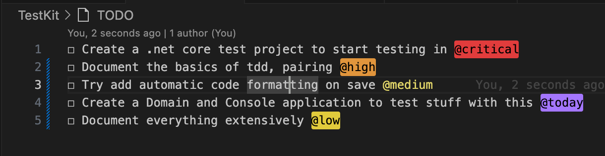

# 📦 CoreTestKit
Help do .Net Core Katas using the latest framework with minimal effort, lots of centralised documents on katas and the latest recomendations

As of May 2025, the latest version of .NET is **.NET 9**, released in November 2024. This version is under Standard Term Support (STS) and is scheduled to receive updates until May 2026. For long-term projects, **.NET 8** remains the Long-Term Support (LTS) version, with support extending until November 2026 .([Wikipedia](https://en.wikipedia.org/wiki/.NET?utm_source=chatgpt.com), [Inedo Blog](https://blog.inedo.com/dotnet/demystifying-lts/?utm_source=chatgpt.com))

[TOC]

## 🛠️ Project Structure

```bash
/TestKit
  ├── Domain/               # Domain models and business logic
  ├── ConsoleApp/           # Entry point console application
  /tests
    └── Domain.Tests/       # xUnit test project for domain logic
    └── ConsoleApp.Tests/   # xUnit test project for domain logic
README.md
```

## 🚀 Getting Started

### Prerequisites

- .NET 8 SDK: [Download](https://dotnet.microsoft.com/en-us/download/dotnet/9.0)([Microsoft](https://dotnet.microsoft.com/en-us/platform/support/policy/dotnet-core?utm_source=chatgpt.com))

### Installation

- Clone the repository:([Coding Militia](https://blog.codingmilitia.com/2018/10/07/aspnet-002-from-zero-to-overkill-project-structure-plus-first-application/?utm_source=chatgpt.com))

```bash
git clone https://github.com/vfarah-if/NodeTestKit
cd your-repo-name
```

- Restore dependencies:

```bash
dotnet restore
```

- Build the solution:

  ```bash
  dotnet build
  ```

## 🧪 Running Tests

Navigate to the test project directory and execute:

```bash
cd tests/Domain.Tests
dotnet test
```

This will build the test project and run all tests using the xUnit framework.

## 📄 Usage

To run the console application:

```bash
cd src/ConsoleApp
dotnet run
```

This will execute the main application logic defined in the `ConsoleApp` project.

## 🧱 Project Details

- **Domain Library**: Contains core business logic for testing.

- **Console Application**: Serves as the entry point, utilising the domain library as a command line utility.

  ```bash
  # See the Makefile for all the available commands
  cd ./publish && dotnet ConsoleApp.dll --help
  info: Program[0]
        Running test command utility
  Description:
    Testing Command Line Utility.
  
  Usage:
    ConsoleApp [command] [options]
  
  Options:
    --version       Show version information
    -?, -h, --help  Show help and usage information
  
  Commands:
    add  Add an array of numbers by command.
  

- **Testing**: Implemented using xUnit to ensure domain logic correctness.


## Most efficient way to start a .Net kata

Help do .net Katas with minimal effort, lots of centralised documents on katas and the latest recomendations. Here is a set of recommendations.

- Fork this and then you just need to branch and code away or allow me to set you up to contribute and simply create a branch to contribute on

  

- Setup with the latest version of .NET

    > [!NOTE]
    >
    > As of May 2025, the latest version of .NET is **.NET 9**, released in November 2024. This version is under Standard Term Support (STS) and is scheduled to receive updates until May 2026. For long-term projects, **.NET 8** remains the Long-Term Support (LTS) version, with support extending until November 2026

- When you hit the refactoring phase, check code for [code smells](https://refactoring.guru/refactoring/smells)

- Project will consist of a domain and a console application for running any domain logic, both supporting xunit

- Make sure you use a timer https://cuckoo.team/ to ping pong between you and remember to optimise your energy and attention span

- Make sure the code formatter and dev environment is working consistently before starting as this will just spoil the flow if it is not setup in a ping pong kinda way

- Make sure as you as developing that follow [Beck's design](https://martinfowler.com/bliki/BeckDesignRules.html) rules:

    - Passes the **tests**
    - Reveals **intention**
    - No **duplication**
    - **Fewest elements** - KISS

- **Communication and respect** is your most effective life skill

## 🧑‍💻 Pair Programming Etiquette: Seven Principles

Effective pair programming enhances collaboration, knowledge sharing, and code quality. Adhering to these principles ensures productive and respectful sessions:

1. **Optimise the Environment**
   Ensure both developers are comfortable with the hardware setup. Accommodate individual IDE preferences to facilitate smooth collaboration.
2. **Prepare the Software**
   Configure the development environment, tools, and dependencies beforehand to minimise disruptions during the session.
3. **Embrace Skill Diversity**
   Pairing individuals with varying experience levels fosters mutual learning. Both the driver and the observer can gain valuable insights from each other.
4. **Maintain Focus**
   Concentrate on the task at hand. Break down large tasks into manageable segments to tackle them sequentially.
5. **Take Regular Breaks**
   Incorporate short breaks to prevent fatigue and maintain high levels of concentration and productivity.
6. **Rotate Pairings**
   Regularly switch pairing partners to disseminate knowledge across the team and prevent information silos.
7. **Respect Your Partner**
   Communicate openly about schedules and changes. Pay attention to small details that can impact your partner's comfort and workflow.

## 🧩 Communication & Conway's Law

**Conway’s Law** states:

> _“Any organisation that designs a system will produce a design whose structure is a copy of the organisation’s communication structure.”_ — Melvin Conway, 1967

### 🧠 Why Communication Matters

Communication isn’t just a team dynamic—it’s a **determinant of software architecture**. According to Conway’s Law, how teams communicate (or fail to) is directly reflected in how systems are designed and built.

### 🔄 Key Implications

- **Team boundaries shape system boundaries**: If teams are siloed, systems are likely to exhibit integration boundaries or coupling problems at the same seams.
- **Cross-team collaboration drives cohesion**: When teams collaborate effectively, the resulting architecture is more modular and consistent.
- **Communication paths influence modularity**: Strong communication within teams tends to foster coherent, well-encapsulated components.

### 🛠 Architectural Relevance

- When designing a system, **organisational structure should be intentional**. Aligning team structure to desired architecture—an approach known as **“inverse Conway manoeuvre”**—helps achieve scalable, maintainable solutions.
- Practices like **Domain-Driven Design (DDD)** and **Team Topologies** leverage this principle to ensure that software mirrors the most effective communication patterns.

## 🧭 The CORE Feedback Method (Radical Candor)

The CORE model offers a structured approach to delivering feedback that is both kind and clear, ensuring it is actionable and fosters trust. It complements the Radical Candor framework, which emphasises **Caring Personally** while **Challenging Directly**.([Radical Candor](https://www.radicalcandor.com/blog/fast-and-meangingful-feedback/?utm_source=chatgpt.com), [Radical Candor](https://www.radicalcandor.com/our-approach/?utm_source=chatgpt.com))

### 🔹 C — Context

Specify the situation to ground the feedback.
_Example_: "During yesterday's team meeting ..."

### 🔹 O — Observation

Describe the specific behaviour observed, avoiding interpretations or judgments.
_Example_: "You interrupted the client before they finished explaining their concern."

### 🔹 R — Result

Explain the impact of the behaviour on the team, project, or individual.
_Example_: "This led to confusion about our proposed solution."

### 🔹 E — nExt stEps

Suggest actionable steps or invite collaboration on solutions.
_Example_: "In future meetings, let's ensure we allow clients to fully express their points before responding."([Radical Candor](https://www.radicalcandor.com/blog/care-personally-team))

By adhering to the CORE method, feedback becomes more structured and effective, promoting a culture of open communication and continuous improvement.

---

For a deeper understanding, refer to the original article: [How To Give Candid Feedback With the Radical Candor CORE Method](https://www.radicalcandor.com/blog/how-to-give-feedback/).([Radical Candor](https://www.radicalcandor.com/blog/how-to-give-feedback/?utm_source=chatgpt.com))

Here's a concise summary of your VS Code TODO utility list, suitable for a README or project planning document:

---

## 📋 TODO Utility Summary

This utility outlines the plan to standardise and streamline kata-based development using Node.js and PNPM, with a focus on effective communication and rapid onboarding.

### 🛠 Tasks Overview

| Priority    | Task                                                                                  |
| ----------- | ------------------------------------------------------------------------------------- |
| 🔴 Critical | Create a repo to standardise the approach using **Node.js** and **PNPM**              |
| 🟠 High     | Document a project skeleton and initialise a repo to establish foundational practices |
| 🟡 Medium   | Develop a basic kata to serve as a quick-start demonstration of the methodology       |
| 🟢 Today    | Explore and present multiple ways of communicating the same concepts effectively      |

### 🎯 Goal

To create a reusable, well-documented kata framework that supports clean coding practices, consistency across projects, and strong communication patterns for technical concepts.

```
☐ Create a repo to standerdise this using Node and PNPM @critical
☐ Document a skeleton and create a repo to set the basics in motion @high
☐ Create a sample basic kata that can be used to demonstrate quickly how we can do this effectively @medium
☐ Show different ways of communicating the same things @today
```



# 📌 Summary

Clear and deliberate communication isn’t ancillary to architecture-it’s foundational. Recognising the impact of organisational structure on technical structure helps avoid accidental complexity and encourages intentional system design. Checkout the [Pull request](https://github.com/vfarah-if/NodeTestKit/pull/1/commits) example on a simple add kata for a basic take on this.
